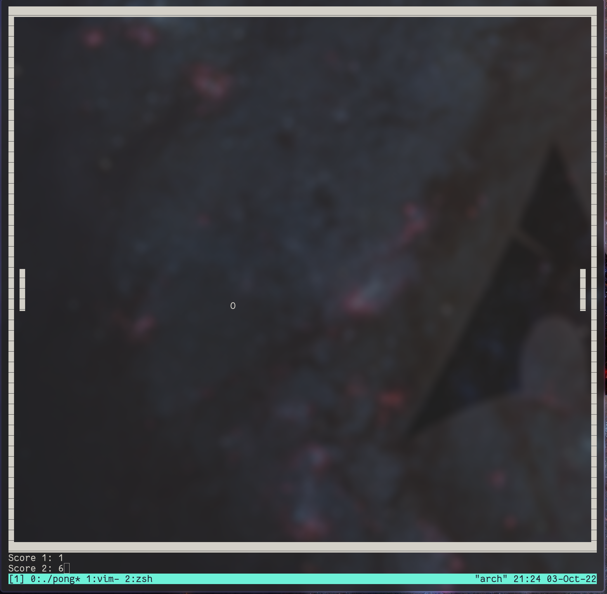

# tui-pong
Terminal pong game written using ncurses in C++.

## Installation
First clone the repo, run `make`, and `./pong` to play.

## Left Player
UP: 'q'

DOWN: 'a'

## Right Player
UP: 'p'

DOWN: ';'
